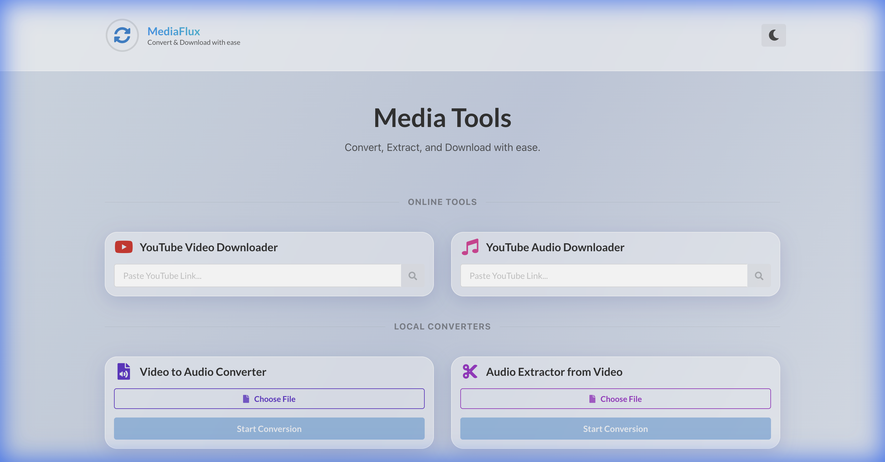
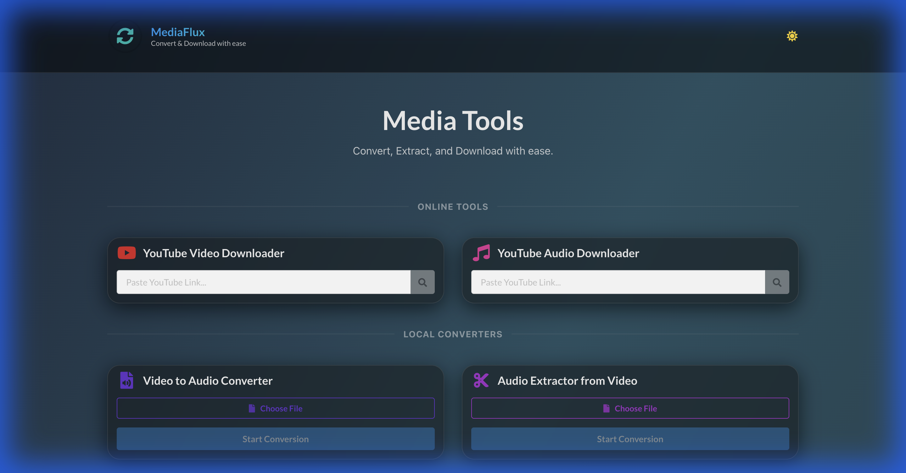

# MediaFlux - Ultimate Media Converter & Downloader

MediaFlux is a powerful, premium Progressive Web App (PWA) designed for seamless media handling. It combines a robust YouTube Downloader with client-side media conversion tools, all wrapped in a stunning Glassmorphism UI.

## 🌐 Live Demo

🔗 **Live Site:** 
[https://mediaconverterapp.netlify.app/](https://mediaconverterapp.netlify.app/)



## 🌟 Key Features

### 🎥 YouTube Downloader
-   **High Quality**: Download videos in up to **4K Resolution** with audio automatically merged.
-   **Formats**: Support for **MP4** (Video) and **MP3** (Audio).
-   **Live Progress**: Real-time download progress bar and file size estimation.
-   **Smart Filenaming**: Files are saved with the video title and resolution tag (e.g., `MyVideo (2160p).mp4`).
-   **Reliable Backend**: Powered by `yt-dlp` to bypass common YouTube restrictions.

### 🔄 Local Media Tools
-   **Privacy First**: All local conversions happen **in your browser** using FFmpeg.wasm. No files are uploaded to any server.
-   **Video to Audio**: Extract high-quality audio from any video file.
-   **Format Conversion**: Convert MOV/MP4 files to MP3 instantly.

### 🎨 Premium UI/UX
-   **Glassmorphism Design**: Modern, translucent interface with dynamic gradients.
-   **Themes**: Fully supported **Dark Mode** and Light Mode (see screenshots).
-   **PWA Ready**: Installable on desktop and mobile for a native app experience.



---

## 🚀 Installation & Usage

### Prerequisites
-   Node.js (v18+)
-   Python 3.10+ (Bundled automatically in Docker/Render deployment)

### 1. Local Development
Clone the repo and install dependencies:

```bash
git clone https://github.com/yourusername/media-converter-app.git
cd media-converter-app
npm install

# Install server dependencies
cd server
npm install
cd ..
```

**Start the App (Frontend + Backend):**
You need to run both the frontend and backend.

**Terminal 1 (Backend):**
```bash
cd server
node index.js
```
*Note: On macOS, the local `yt-dlp` and `ffmpeg` binaries in `server/` will be used automatically.*

**Terminal 2 (Frontend):**
```bash
npm run dev
```
Open `http://localhost:5173` in your browser.

### 2. Deployment (Free on Render.com)
For actual usage, deploy the backend to Render (Docker) and frontend to Vercel/Netlify.
See [DEPLOYMENT_GUIDE.md](DEPLOYMENT_GUIDE.md) for full instructions.

## 🛠 Tech Stack
-   **Frontend**: React, Vite, Semantic UI React, AOS (Animations).
-   **Processing**: FFmpeg.wasm (Client-side), Child Process (Server-side).
-   **Backend**: Node.js, Express, `yt-dlp` (Binary), `ffmpeg` (Binary).

## 📄 License
MIT License © 2026. See [LICENSE](LICENSE) for details.

## 👨‍💻 Author
**Francis Cruz**
- [GitHub](https://github.com/ajf013)
- [LinkedIn](https://www.linkedin.com/in/ajf013-francis-cruz/)

## You can reach out 😊😊
Feel free to contact me about the problems. I will try to help as much as I can 😉

[](https://www.linkedin.com/in/ajf013-francis-cruz/)
[](mailto:cruzmma2021@gmail.com)
[](https://github.com/ajf013)